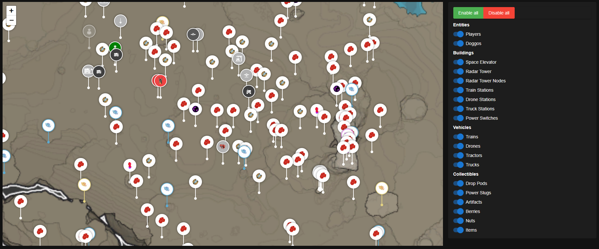
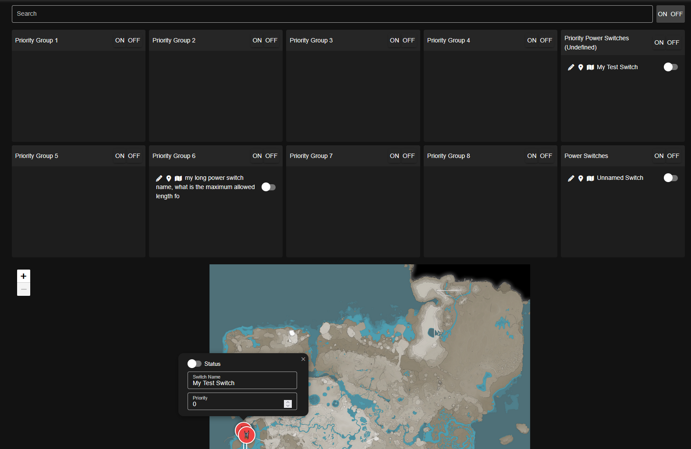
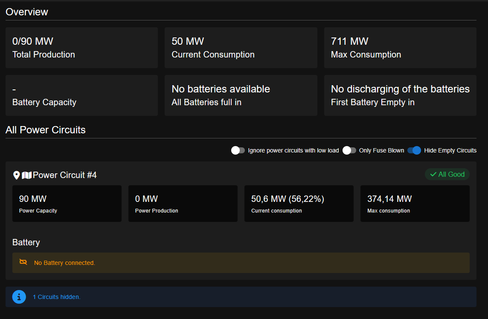
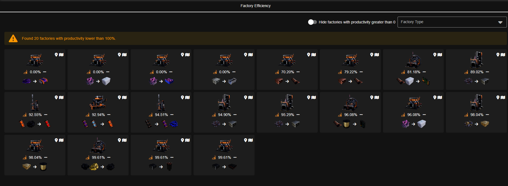
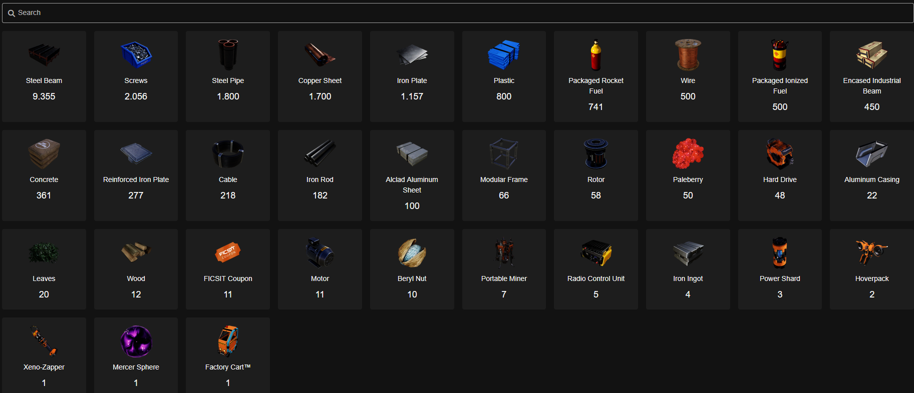

# FicsIt Remote Monitoring Dashboard

## How to use

### Prequisites

- You need to have the mod [Ficsit Remote Monitoring](https://ficsit.app/mod/FicsitRemoteMonitoring) installed.
- Start the FRM webserver with `/frm http start` or for dedicated server you can use the built in dedicated server API (released in FRM 1.4).

### Using the Dashboard

Once your game/server and the FRM webserver are started, you can access the dashboard via https://ficsit.pages.dev/.

### Starting the Dashboard locally

- Install Node.js and any package installer
- Install all dependencies with e.g. `npm install` for NPM.
- Start the dashboard with `npm run dev`.
- Access the Dashboard via http://localhost:9000

## Images

